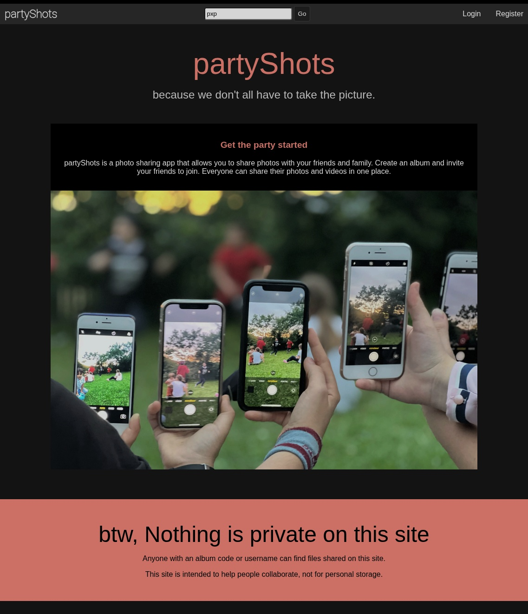
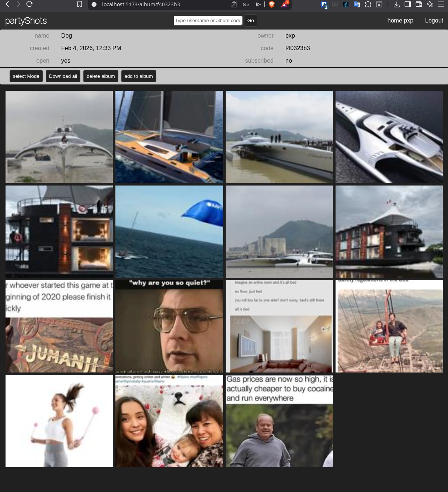

# partyShots

## Todo List

* Lock Album (maybe)
* Hide Album (maybe)
* File Size Limits

# partyShots

**A photo‑sharing platform built with Django, PostgreSQL, Amazon S3, and Vite.**  
The project follows a clean separation of concerns:  
* **Django** handles authentication, API endpoints, and business logic.  
* **PostgreSQL** stores relational data (users, albums, photo metadata).  
* **Amazon S3** holds the actual image files.  
* **Vite** powers the SPA front‑end (React + Tailwind) that consumes the Django REST API.

## Structure and Logic
This is quite simple.  Users create albums, and albums have files.  Any user is allowed to add files to any album.  
Files may be removed from an album only by the user who posted them, or the creator of the album.  

Everything is public.  

### Users 
Users can create albums, and add files to albums.  
Any user can add files to any album.  
Users can only remove files that they posted, or files in albums they created.

### Albums
Albums are collections of files.  
Albums are created by users.

### Files
Files are uploaded by users to albums.  
Files are stored in Amazon S3, and metadata is stored in PostgreSQL.  
Files can be removed by the user who posted them, or the creator of the album they belong to.
